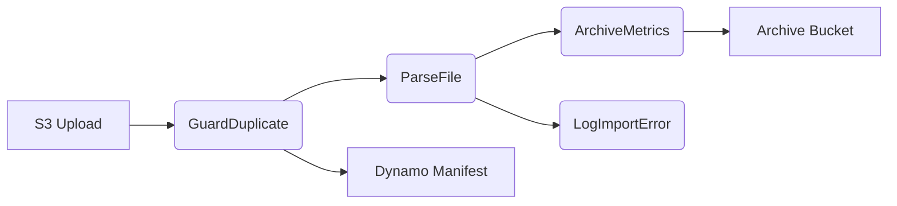

# file-processor-sample

This project demonstrates a simple file processing pipeline using AWS Lambda and Step Functions. Files uploaded to S3 are validated, parsed, archived and errors logged. The code is written in Go 1.22 and deployable with AWS SAM.

## Project purpose & scope
The repo provides a starter implementation for handling delimited files in a batch process. It shows how to guard against duplicates, parse files with plug‑ins, archive results and report import errors.

## Quickstart
1. **Prerequisites**: Go 1.22, Docker, AWS CLI, and SAM CLI.
2. **Clone & build**
   ```bash
   git clone <repo>
   cd file-processor-sample
   make build
   ```
3. **Deploy to dev**
   ```bash
   make sam-deploy-dev
   ```

## Architecture diagram


## Lambda descriptions
- **GuardDuplicate** – validates size, computes SHA‑256 and writes to Dynamo manifest.
- **ParseFile** – loads `csv_pipe` parser plug‑in, trims fields and outputs JSONL chunks.
- **ArchiveMetrics** – archives the file, updates manifest and emits metrics.
- **LogImportError** – upserts `Import_Error__c` records through REST API.

## Running unit tests locally
Run all tests and linters with:
```bash
make build
```

## Invoking Lambdas with SAM CLI events
```
sam local invoke GuardDuplicate --event testdata/s3_event.json
```

## Cleaning up resources
Remove the stack and artifacts:
```bash
sam delete --stack-name file-processor-dev
```
