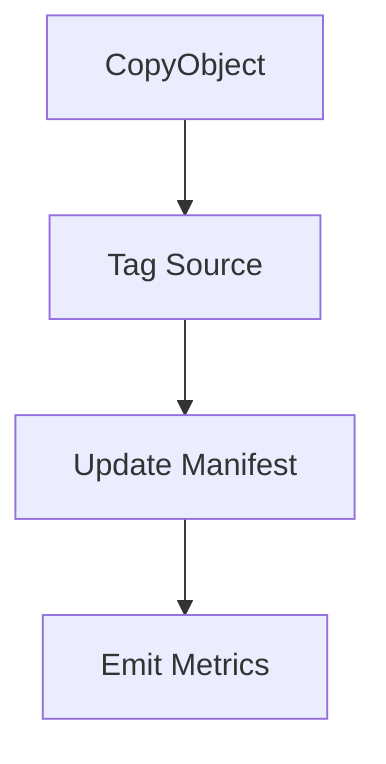

# ArchiveMetrics Lambda

This function moves processed files to an archive prefix and records import statistics.

## Responsibilities
1. Copy the uploaded object to `/archive/YYYY/MM/DD/` using `CopyObject`.
2. Tag the source object with `processed=true`.
3. Update the `FileImportManifest` item with `rowsProcessed`, `rowsFailed` and `status`.
4. Emit CloudWatch metrics for `RowsProcessed`, `RowsFailed` and `ArchiveLatencyMs`.

The handler is idempotent. If an object is already tagged `processed=true` it exits without error.

### IAM least privilege
| Action | Resource |
|-------|---------|
| `s3:GetObjectTagging` `s3:PutObjectTagging` `s3:CopyObject` | source bucket objects |
| `dynamodb:UpdateItem` | manifest table item |
| `cloudwatch:PutMetricData` | custom metrics namespace |

## Flow


### How to Add a New Process
1. **Author a Profile v2:** copy the sample JSON, adjust limits & mappings, then save as `/crm/file-profiles/<env>/<source>.json` in SSM.
2. **Connect Row Step Function:** set `rowStateMachineArn` to a new or existing row-level SFN.
3. **Deploy:** `sam deploy --guided` — core Lambdas need no changes.
4. **Validate:** run `profile-lint` then upload a test file to `crm-incoming/<source>/dev/`.
5. **Monitor:** dashboards show `RowsProcessed`, `RowsFailed`, alarms, and metrics.

### Profile v2 Schema & Sample
*Canonical schema:* [`schema/profile_v2.schema.json`](../../schema/profile_v2.schema.json)
*Example profile (Flood QNS):*
```json
{
  "parserId": "csv_pipe",
  "maxBytes": 8000000,
  "...":      "..."
}
```

