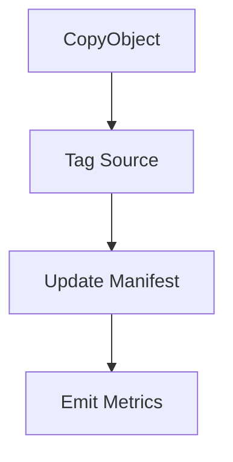

# ArchiveMetrics Lambda

This function moves processed files to an archive prefix and records import statistics.

## Responsibilities
1. Copy the uploaded object to `/archive/YYYY/MM/DD/` using `CopyObject`.
2. Tag the source object with `processed=true`.
3. Update the `FileImportManifest` item with `rowsProcessed`, `rowsFailed` and `status`.
4. Emit CloudWatch metrics for `RowsProcessed`, `RowsFailed` and `ArchiveLatencyMs`.

The handler is idempotent. If an object is already tagged `processed=true` it exits without error.

### IAM least privilege
| Action | Resource |
|-------|---------|
| `s3:GetObjectTagging` `s3:PutObjectTagging` `s3:CopyObject` | source bucket objects |
| `dynamodb:UpdateItem` | manifest table item |
| `cloudwatch:PutMetricData` | custom metrics namespace |

## Flow

