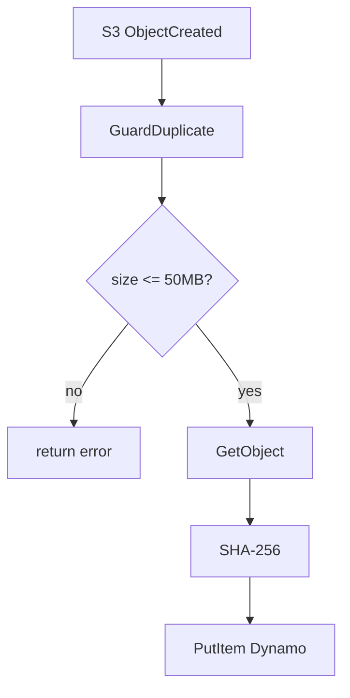

# GuardDuplicate

This Lambda validates new S3 objects before they enter the file processing pipeline. It rejects files larger than 50&nbsp;MB, computes a SHA‑256 checksum and records the result in DynamoDB.

## Flow
1. Triggered by `ObjectCreated` events from S3.
2. Downloads the object and calculates its SHA‑256 digest.
3. Writes an item to the manifest table containing the file key and checksum.

## S3 Event Input
```json
{
  "Records": [
    {
      "s3": {
        "bucket": {"name": "source-bucket"},
        "object": {"key": "example.csv", "size": 123}
      }
    }
  ]
}
```

## Environment Variables
- `MANIFEST_TABLE` – DynamoDB table where file manifests are stored.

## Output
A new item is inserted into the manifest table with fields `FileKey`, `SHA256` and `Processed=false`. A structured log entry `{"msg":"manifest updated","key":"<file>","sha":"<digest>"}` is emitted.

## Diagram

```
