# LogImportError

This Lambda records failed row imports in Salesforce. It upserts `Import_Error__c`
records using the row's external identifier. A token is requested from the token
broker before calling Salesforce.

Sample event payload:
```json
{
  "externalRowId": "row1",
  "message": "bad data"
}
```

Environment variables:
- `BROKER_URL` – endpoint for retrieving Salesforce bearer tokens.
- `SF_API` – base Salesforce REST API URL, e.g. `https://example.my.salesforce.com/services/data/v59.0`.

```mermaid
sequenceDiagram
    participant R as Row-SFN
    participant L as Log&#955;
    participant B as Broker
    participant SF as SF
    R->>L: Invoke with row details
    L->>B: Request token
    B-->>L: Bearer token
    L->>SF: PATCH Import_Error__c
```


