# LogImportError

This Lambda records failed row imports in Salesforce. It upserts `Import_Error__c`
records using the row's external identifier. A token is requested from the token
broker before calling Salesforce.

Sample event payload:
```json
{
  "externalRowId": "row1",
  "message": "bad data"
}
```

Environment variables:
- `BROKER_URL` – endpoint for retrieving Salesforce bearer tokens.
- `SF_API` – base Salesforce REST API URL, e.g. `https://example.my.salesforce.com/services/data/v59.0`.

```mermaid
sequenceDiagram
    participant R as Row-SFN
    participant L as Log&#955;
    participant B as Broker
    participant SF as SF
    R->>L: Invoke with row details
    L->>B: Request token
    B-->>L: Bearer token
    L->>SF: PATCH Import_Error__c
```



### How to Add a New Process
1. **Author a Profile v2:** copy the sample JSON, adjust limits & mappings, then save as `/crm/file-profiles/<env>/<source>.json` in SSM.
2. **Connect Row Step Function:** set `rowStateMachineArn` to a new or existing row-level SFN.
3. **Deploy:** `sam deploy --guided` — core Lambdas need no changes.
4. **Validate:** run `profile-lint` then upload a test file to `crm-incoming/<source>/dev/`.
5. **Monitor:** dashboards show `RowsProcessed`, `RowsFailed`, alarms, and metrics.

### Profile v2 Schema & Sample
*Canonical schema:* [`schema/profile_v2.schema.json`](../../schema/profile_v2.schema.json)
*Example profile (Flood QNS):*
```json
{
  "parserId": "csv_pipe",
  "maxBytes": 8000000,
  "...":      "..."
}
```

