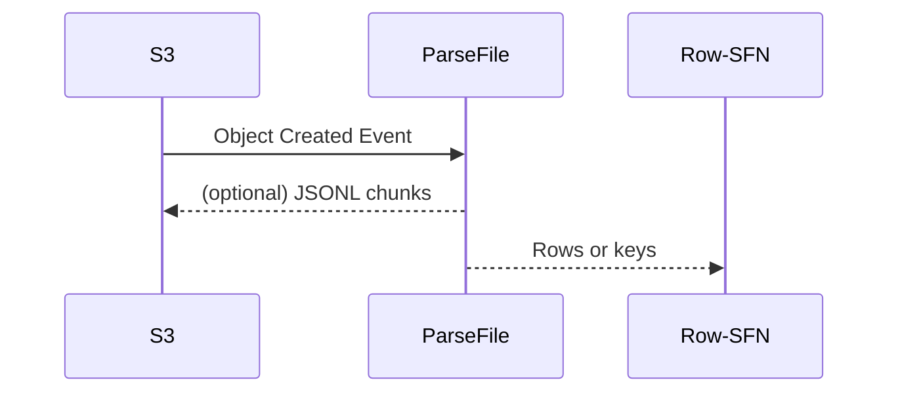

# ParseFile Lambda

This function reads an object from S3, parses it using a plug-in parser and returns
row data or S3 keys for JSONL chunks. The handler signature is:

```go
func handler(ctx context.Context, evt events.S3Event) (Output, error)
```

`PARSER_ID` chooses the plug-in (`csv_pipe`, `fixed_width`, `xlsx_sheet`).
`PROFILE_JSON` supplies required columns:

```json
{
  "required": ["header1", "header2"]
}
```

## I/O contract
- **Input**: `events.S3Event`
- **Output**: `Output` with `Rows` or uploaded chunk keys and `BadRows` count.



### How to Add a New Process
1. **Author a Profile v2:** copy the sample JSON, adjust limits & mappings, then save as `/crm/file-profiles/<env>/<source>.json` in SSM.
2. **Connect Row Step Function:** set `rowStateMachineArn` to a new or existing row-level SFN.
3. **Deploy:** `sam deploy --guided` — core Lambdas need no changes.
4. **Validate:** run `profile-lint` then upload a test file to `crm-incoming/<source>/dev/`.
5. **Monitor:** dashboards show `RowsProcessed`, `RowsFailed`, alarms, and metrics.

### Profile v2 Schema & Sample
*Canonical schema:* [`schema/profile_v2.schema.json`](../../schema/profile_v2.schema.json)
*Example profile (Flood QNS):*
```json
{
  "parserId": "csv_pipe",
  "maxBytes": 8000000,
  "...":      "..."
}
```

