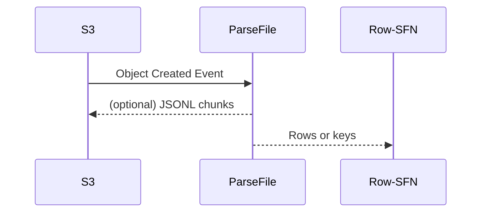

# ParseFile Lambda

This function reads an object from S3, parses it using a plug-in parser and returns
row data or S3 keys for JSONL chunks. The handler signature is:

```go
func handler(ctx context.Context, evt events.S3Event) (Output, error)
```

`PARSER_ID` chooses the plug-in (`csv_pipe`, `fixed_width`, `xlsx_sheet`).
`PROFILE_JSON` supplies required columns:

```json
{
  "required": ["header1", "header2"]
}
```

## I/O contract
- **Input**: `events.S3Event`
- **Output**: `Output` with `Rows` or uploaded chunk keys and `BadRows` count.


