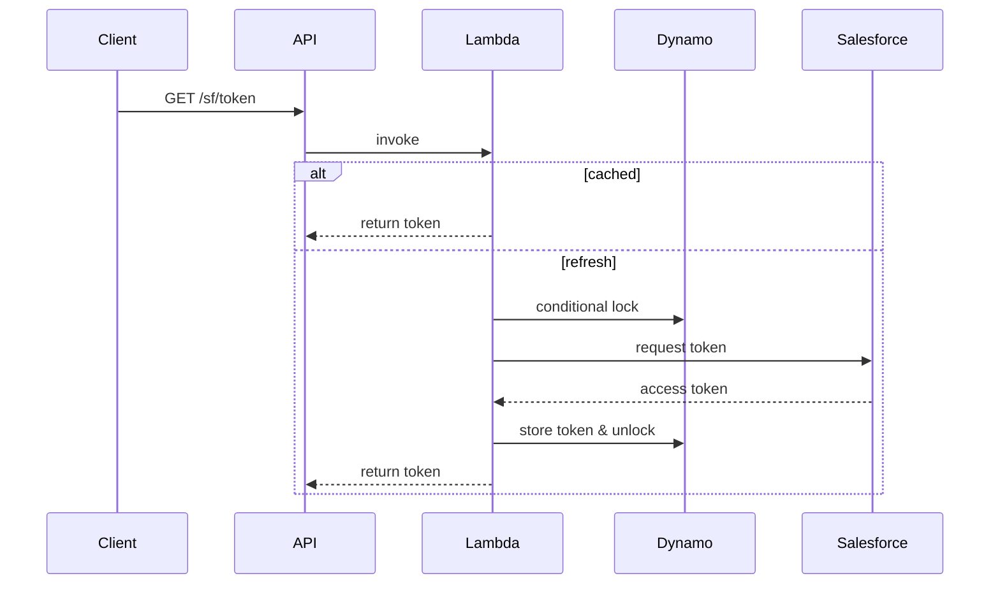

# Token Broker Lambda

This Lambda exposes `GET /sf/token` via API Gateway and brokers Salesforce access
tokens. Tokens are cached in memory for five minutes and persisted in DynamoDB
`SfAuthToken` items (`PK=appId#env`). A conditional update with the
`refreshing` flag ensures only one instance refreshes the token at a time. The
function publishes `TokenRefreshCount` and `BrokerLatencyMs` metrics to
CloudWatch and uses zap for structured logs.

## Environment variables
- `APP_ID` – application identifier used in Dynamo primary key
- `ENV` – environment name (dev, prod ...)
- `SF_TOKEN_URL` – Salesforce OAuth token endpoint
- `SF_CLIENT_ID` – OAuth client id
- `SF_CLIENT_SECRET` – OAuth client secret
- `SF_USERNAME` – username
- `SF_PASSWORD` – password
- `AUTH_TABLE` – DynamoDB table name (default `SfAuthToken`)

## Sequence diagram


### How to Add a New Process
1. **Author a Profile v2:** copy the sample JSON, adjust limits & mappings, then save as `/crm/file-profiles/<env>/<source>.json` in SSM.
2. **Connect Row Step Function:** set `rowStateMachineArn` to a new or existing row-level SFN.
3. **Deploy:** `sam deploy --guided` — core Lambdas need no changes.
4. **Validate:** run `profile-lint` then upload a test file to `crm-incoming/<source>/dev/`.
5. **Monitor:** dashboards show `RowsProcessed`, `RowsFailed`, alarms, and metrics.

### Profile v2 Schema & Sample
*Canonical schema:* [`schema/profile_v2.schema.json`](../../schema/profile_v2.schema.json)
*Example profile (Flood QNS):*
```json
{
  "parserId": "csv_pipe",
  "maxBytes": 8000000,
  "...":      "..."
}
```

