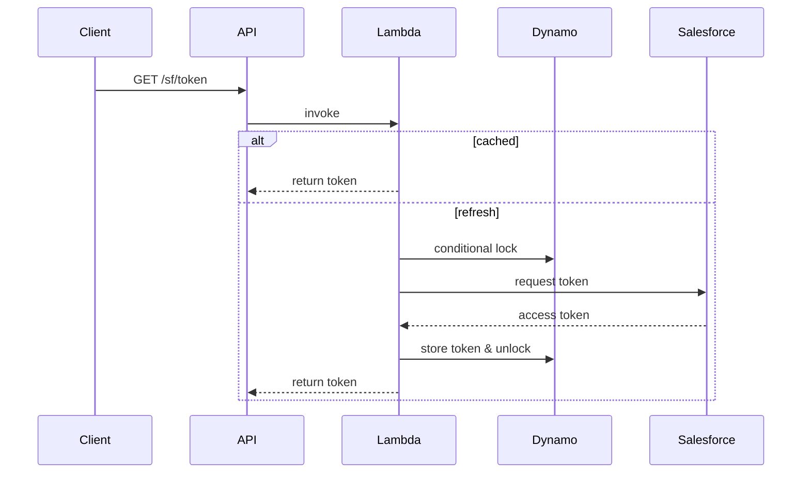

# Token Broker Lambda

This Lambda exposes `GET /sf/token` via API Gateway and brokers Salesforce access
tokens. Tokens are cached in memory for five minutes and persisted in DynamoDB
`SfAuthToken` items (`PK=appId#env`). A conditional update with the
`refreshing` flag ensures only one instance refreshes the token at a time. The
function publishes `TokenRefreshCount` and `BrokerLatencyMs` metrics to
CloudWatch and uses zap for structured logs.

## Environment variables
- `APP_ID` – application identifier used in Dynamo primary key
- `ENV` – environment name (dev, prod ...)
- `SF_TOKEN_URL` – Salesforce OAuth token endpoint
- `SF_CLIENT_ID` – OAuth client id
- `SF_CLIENT_SECRET` – OAuth client secret
- `SF_USERNAME` – username
- `SF_PASSWORD` – password
- `AUTH_TABLE` – DynamoDB table name (default `SfAuthToken`)

## Sequence diagram

