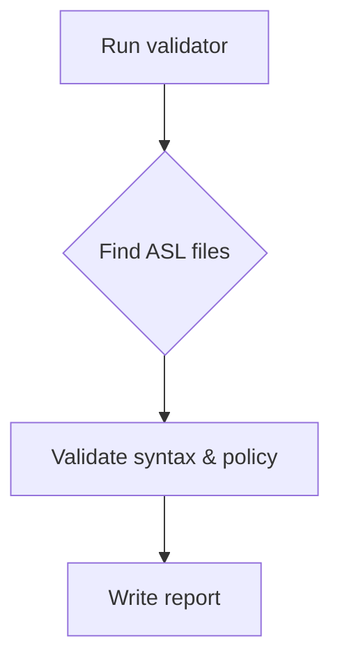

# Validator Utility

This CLI scans Step Function definitions and generates an audit report. It is intended for local validation prior to opening a pull request.

## Usage

```
go run ./cmd/validator
```

All `*.asl.json` files under `sfn`, `infra` and `cmd` are validated. Missing definitions for profiles listed in `sample-profiles/` will create tasks under `tasks/`.

## Output
- `audit/Project-Status-Report.md` – table of files and pass/fail status.
- `tasks/TASK-SFN-<id>_<name>.md` – remediation tasks for each failing file or missing definition.



### How to Add a New Process
1. **Author a Profile v2:** copy the sample JSON, adjust limits & mappings, then save as `/crm/file-profiles/<env>/<source>.json` in SSM.
2. **Write State Machine:** create `sfn/<source>.asl.json` describing the file workflow.
3. **Run validator:** `go run ./cmd/validator` and resolve any tasks generated.

### Profile v2 Schema & Sample
*Canonical schema:* [`../../schema/profile_v2.schema.json`](../../schema/profile_v2.schema.json)
*Example profile (Campaign):*
```json
{
  "parserId": "csv_pipe",
  "maxBytes": 1000000,
  "...": "..."
}
```
