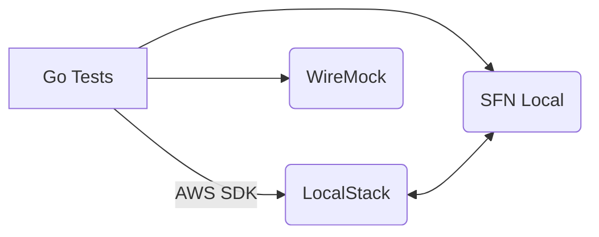

# End-to-end Tests

These tests run the `<feed>-Wrapper` Step Function on a local stack consisting of
LocalStack, Step Functions Local and WireMock. The harness provisions resources,
uploads a sample file and asserts DynamoDB, CloudWatch and WireMock behaviour.

## Quick start
```bash
make up      # start LocalStack + SFN Local + WireMock
make test    # run the e2e test suite
make down    # stop containers
```

## Diagram

